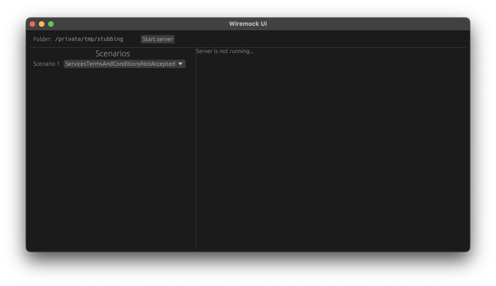

# WiremockUI

[](./LICENSE.md)
[](https://github.com/thebino/wiremock-ui/workflows/continuous-delivery-pipeline.yml)

WiremockUI is a Ui application to extend the [WireMock Standalone Process](https://wiremock.org/docs/standalone/java-jar/)

Its features are:
 * Change scenarios
 * Reload mappings on file change

## Dependencies
- [wiremock-rs](https://github.com/LukeMathWalker/wiremock-rs/)
    - 💥 config files not supproted [#129](https://github.com/LukeMathWalker/wiremock-rs/issues/129)
- [stubr](https://github.com/beltram/stubr/) _wiremock-rs fork w/ config files_
    - 💥 scenarios not supported [#493](https://github.com/beltram/stubr/issues/493)
- [Command::spawn](https://doc.rust-lang.org/std/process/struct.Command.html#method.spawn)
    - 👍 blocking `java process`
- [tokio::process](https://docs.rs/tokio/latest/tokio/process/index.html)
    - ✨ non-blocking async `java process` based on tokio

---




## 🏛️ License
```
WiremockUi · A Ui application to extend Wiremock
Copyright (C) 2023 Stürmer, Benjamin

This program is free software: you can redistribute it and/or modify
it under the terms of the GNU Affero General Public License as
published by the Free Software Foundation, either version 3 of the
License, or (at your option) any later version.

This program is distributed in the hope that it will be useful,
but WITHOUT ANY WARRANTY; without even the implied warranty of
MERCHANTABILITY or FITNESS FOR A PARTICULAR PURPOSE.  See the
GNU Affero General Public License for more details.

You should have received a copy of the GNU Affero General Public License
along with this program.  If not, see <https://www.gnu.org/licenses/>.
```
